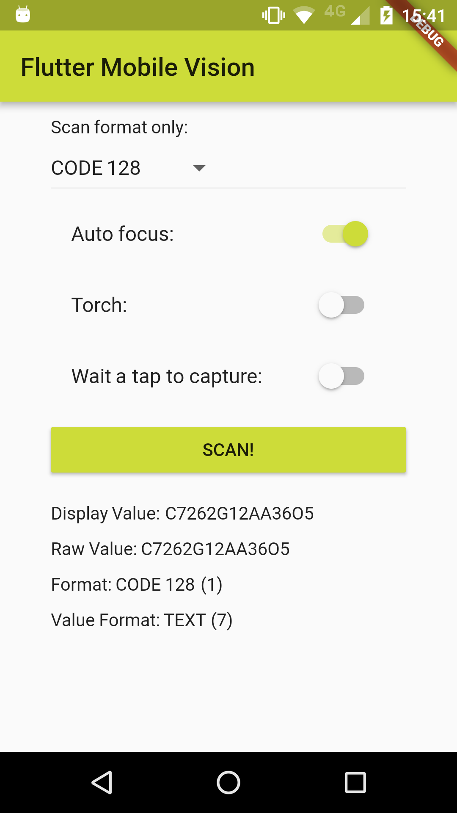
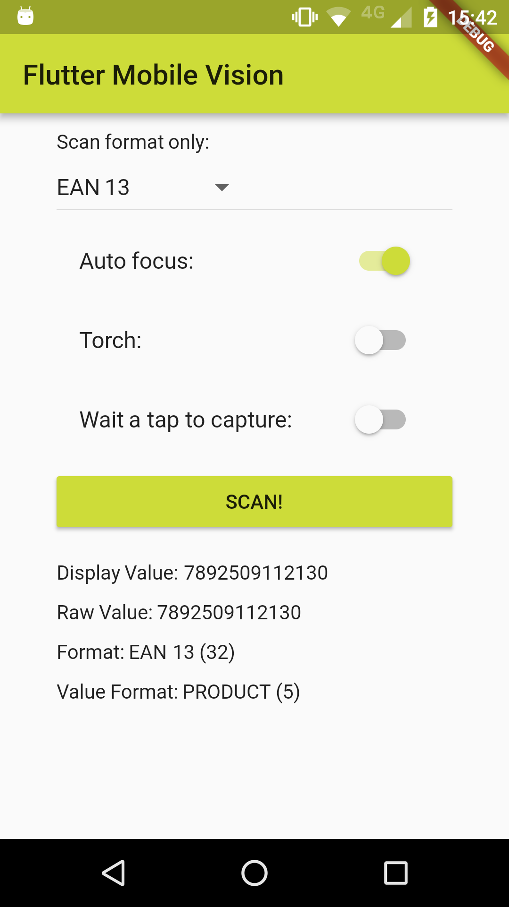
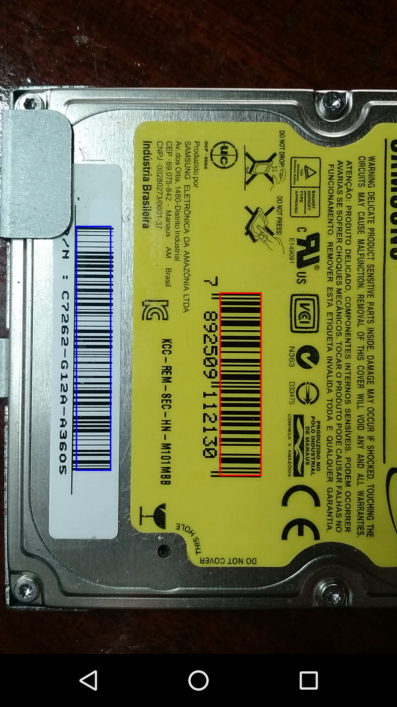
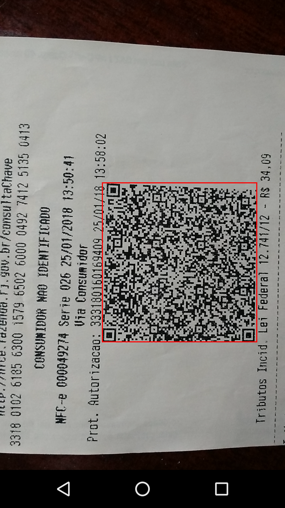

# flutter_mobile_vision

Flutter implementation for Google Mobile Vision.

Based on [Google Mobile Vision](https://developers.google.com/vision/).

[Android Samples](https://github.com/googlesamples/android-vision) -=- [iOS Samples](https://github.com/googlesamples/ios-vision)

Liked? :star: Star the repo to support the project!

## Features

* [ ] Android
   * [ ] Barcode Scan
      * [x] Simple scan.
      * [x] Toggle torch.
      * [x] Toggle auto focus.
      * [x] Specify types of barcodes that will be read.
      * [x] Tap to capture.
      * [x] Select barcode type to be scanned.
      * [ ] Scan multiple barcodes.
   * [ ] Recognize Text
      * [ ] _Future Tasks_
   * [ ] Detect Faces
      * [ ] _Future Tasks_

* [ ] iOS
   * [ ] Barcode Scan
      * [ ] _Future Tasks_
   * [ ] Recognize Text
      * [ ] _Future Tasks_
   * [ ] Detect Faces
      * [ ] _Future Tasks_

## Screenshots
   

## Usage

[Example](https://github.com/edufolly/flutter_mobile_vision/blob/master/example/lib/main.dart)

To use this plugin :

* add the dependency to your [pubspec.yaml](https://github.com/iampawan/Flute-Music-Player/blob/master/example/pubspec.yaml) file:

```yaml
  dependencies:
    flutter:
      sdk: flutter
    flutter_mobile_vision:
```

* read a barcode:

```dart
//...
String displayValue = 'Unknown';
String rawValue = 'Unknown';
String format = 'Unknown';
String valueFormat = 'Unknown';

try {
  Barcode barcode = await FlutterMobileVision.scan();
  displayValue = barcode.displayValue;
  rawValue = barcode.rawValue;
  format = '${barcode.getFormatString()} (${barcode.format})';
  valueFormat =
      '${barcode.getValueFormatString()} (${barcode.valueFormat})';
} on Exception {
  displayValue = 'Failed to get barcode.';
}
//...
```

## Android

For Android, you must do the following before you can use the plugin:

* Add the camera permission to your AndroidManifest.xml

    `<uses-feature android:name="android.hardware.camera" />`

    `<uses-permission android:name="android.permission.CAMERA" />`

* Add the Barcode activity to your AndroidManifest.xml

    `<activity android:name="io.github.edufolly.fluttermobilevision.BarcodeCaptureActivity" />`

## iOS
If you can help, the community thanks. Your fork is needed. :wink: