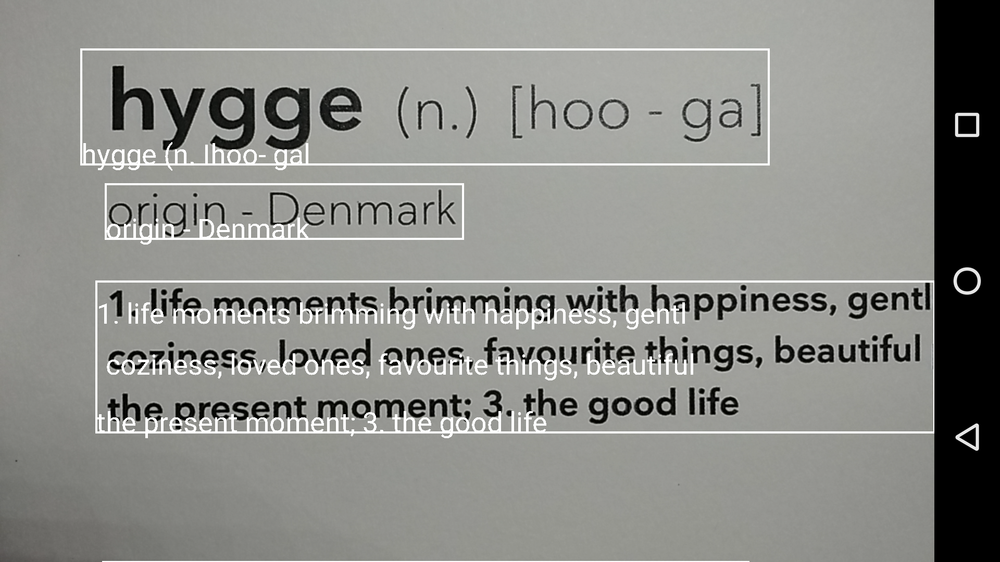

# flutter_mobile_vision

[](https://app.codacy.com/app/edufolly/flutter_mobile_vision?utm_source=github.com&utm_medium=referral&utm_content=edufolly/flutter_mobile_vision&utm_campaign=badger) [](https://pub.dartlang.org/packages/flutter_mobile_vision)

Flutter implementation for Google Mobile Vision.

Based on [Google Mobile Vision](https://developers.google.com/vision/).

[Android Samples](https://github.com/googlesamples/android-vision) -=- [iOS Samples](https://github.com/googlesamples/ios-vision)

Liked? :star: Star the repo to support the project!

## Features

* [ ] Android
   * [ ] Barcode Scan
      * [x] Simple scan.
      * [x] Toggle torch.
      * [x] Toggle auto focus.
      * [x] Specify types of barcodes that will be read.
      * [x] Tap to capture.
      * [x] Select barcode type to be scanned.
      * [x] Scan multiple barcodes.
      * [x] Barcode coordinates.
   * [ ] Recognize Text
      * [x] Simple OCR.
      * [x] Multiple recognition.
      * [x] Text language.
      * [x] Text coordinates.
   * [ ] Detect Faces
      * [ ] _Future Tasks_

* [ ] iOS
   * [ ] Barcode Scan
      * [ ] _Future Tasks_
   * [ ] Recognize Text
      * [ ] _Future Tasks_
   * [ ] Detect Faces
      * [ ] _Future Tasks_

## Screenshots
    

## Usage

[Example](https://github.com/edufolly/flutter_mobile_vision/blob/master/example/lib/main.dart)

To use this plugin :

* add the dependency to your `pubspec.yaml` file:

```yaml
  dependencies:
    flutter:
      sdk: flutter
    flutter_mobile_vision: ^0.0.2
```

-----

## Barcode

```dart
//...
List<Barcode> barcodes = [];
try {
  barcodes = await FlutterMobileVision.scan(
    flash: _torch,
    autoFocus: _autoFocus,
    formats: _onlyFormat,
    multiple: _multiple,
    waitTap: _waitTap,
  );
} on Exception {
  barcodes.add(new Barcode('Failed to get barcode.'));
}
//...
```

### Android

For Android, you must do the following before you can use the plugin:

* Add the camera permission to your AndroidManifest.xml

    `<uses-feature android:name="android.hardware.camera" />`

    `<uses-permission android:name="android.permission.CAMERA" />`

* Add the Barcode activity to your AndroidManifest.xml

    `<activity android:name="io.github.edufolly.fluttermobilevision.BarcodeCaptureActivity" />`

### iOS

If you can help, the community thanks. Your fork is needed. :wink:

------

## OCR

```dart
//...
List<OcrText> texts = [];
try {
  texts = await FlutterMobileVision.read(
    flash: _torchOcr,
    autoFocus: _autoFocusOcr,
    multiple: _multipleOcr,
  );
} on Exception {
  texts.add(new OcrText('Failed to get barcode.'));
}
//...
```

### Android

For Android, you must do the following before you can use the plugin:

* Add the camera permission to your AndroidManifest.xml

    `<uses-feature android:name="android.hardware.camera" />`

    `<uses-permission android:name="android.permission.CAMERA" />`

* Add the OCR activity to your AndroidManifest.xml

   `<activity android:name="io.github.edufolly.fluttermobilevision.ocr.OcrCaptureActivity" />`

### iOS

If you can help, the community thanks. Your fork is needed. :wink:
